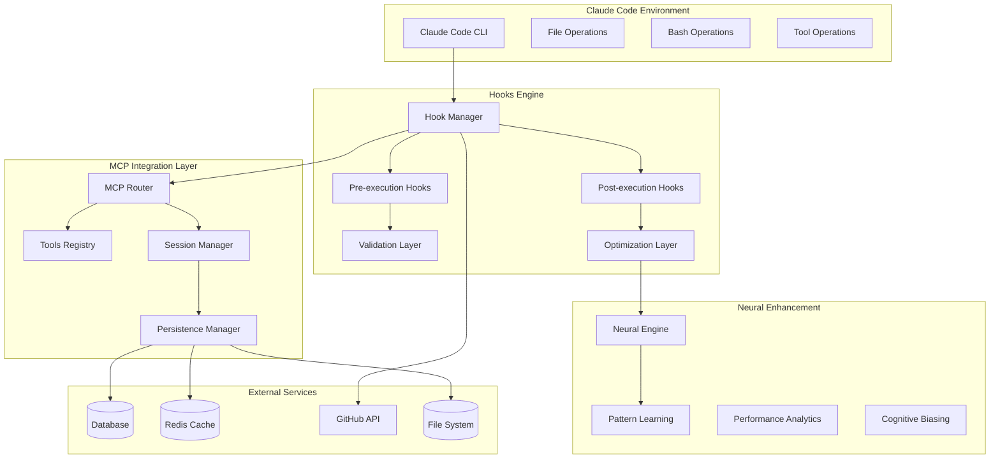

# Sophisticated Hooks System Architecture for MCP Tools Integration

## Executive Summary

This document presents a comprehensive architecture for a sophisticated hooks system that seamlessly integrates MCP (Model Context Protocol) tools with Claude Code operations. The system provides pre/post execution hooks, Claude-specific optimization patterns, tool discovery APIs, and cross-session persistence capabilities.

## Table of Contents

1. [Architecture Overview](#architecture-overview)
2. [Hook Types & Lifecycle](#hook-types--lifecycle)
3. [MCP Tools Registry](#mcp-tools-registry)
4. [Session Management](#session-management)
5. [Implementation Details](#implementation-details)
6. [Performance Optimization](#performance-optimization)
7. [Security & Validation](#security--validation)
8. [Deployment Strategy](#deployment-strategy)

## Architecture Overview

### Core Components



### Key Design Principles

1. **Non-blocking Operation**: Hooks never prevent normal execution flow
2. **Intelligent Defaults**: System works optimally with minimal configuration
3. **Progressive Enhancement**: Features activate based on available resources
4. **Cross-session Persistence**: Knowledge persists between Claude Code sessions
5. **Autonomous Learning**: System improves through usage patterns

## Hook Types & Lifecycle

### Pre-execution Hooks

#### 1. Pre-Tool Validation Hook
**Purpose**: Validate MCP tool parameters and system state before execution

```typescript
interface PreToolHookArgs {
  tool: string;
  params: Record<string, any>;
  context: ExecutionContext;
  metadata?: Record<string, any>;
}

interface PreToolHookResult {
  continue: boolean;
  optimizations?: ToolOptimization[];
  resourcePreparation?: ResourcePrep[];
  warnings?: ValidationWarning[];
  metadata?: Record<string, any>;
}
```

**Responsibilities**:
- Parameter validation and sanitization
- Resource availability checks
- Swarm state verification
- Optimal tool selection recommendations
- Agent assignment and spawning

#### 2. Pre-File Operation Hook
**Purpose**: Coordinate file operations with active swarm agents

```typescript
interface PreFileHookArgs {
  operation: 'read' | 'write' | 'edit' | 'delete';
  filePath: string;
  content?: string;
  agent?: string;
}

interface PreFileHookResult {
  continue: boolean;
  assignedAgent?: AgentInfo;
  backupCreated?: boolean;
  conflictDetection?: ConflictInfo[];
  recommendations?: FileOpRecommendation[];
}
```

#### 3. Pre-Session Hook
**Purpose**: Initialize or restore session state

```typescript
interface PreSessionHookArgs {
  sessionId?: string;
  restoreState?: boolean;
  loadAgents?: boolean;
  initializeSwarm?: boolean;
}
```

### Post-execution Hooks

#### 1. Post-Tool Execution Hook
**Purpose**: Process results, update metrics, and trigger learning

```typescript
interface PostToolHookArgs {
  tool: string;
  params: Record<string, any>;
  result: ToolExecutionResult;
  duration: number;
  success: boolean;
}

interface PostToolHookResult {
  metricsUpdated: boolean;
  patternsLearned: string[];
  cacheUpdated?: boolean;
  nextRecommendations?: ToolRecommendation[];
}
```

**Responsibilities**:
- Performance metrics collection
- Neural pattern training
- Cache invalidation and updates
- Result analysis and insight extraction
- Cross-tool coordination signals

#### 2. Post-Operation Cleanup Hook
**Purpose**: Cleanup resources and optimize system state

```typescript
interface PostCleanupHookArgs {
  operation: string;
  resources: ResourceUsage;
  artifacts: CreatedArtifact[];
}
```

### Claude-specific Optimization Hooks

#### 1. Context Optimization Hook
**Purpose**: Optimize Claude's context usage and token efficiency

```typescript
interface ContextOptimizationHook {
  compressHistory(): ContextCompression;
  extractKeyPatterns(): Pattern[];
  generateContextSummary(): ContextSummary;
  optimizeTokenUsage(): TokenOptimization;
}
```

#### 2. Multi-turn Conversation Hook
**Purpose**: Maintain state across multiple Claude interactions

```typescript
interface ConversationStateHook {
  preserveImportantContext(): PreservedContext;
  trackTopicEvolution(): TopicEvolution;
  maintainPersonalization(): PersonalizationData;
  optimizeResponseGeneration(): ResponseOptimization;
}
```

## MCP Tools Registry

### Registry API Architecture

```typescript
interface ToolsRegistry {
  // Discovery endpoints
  getAllTools(): Promise<ToolDefinition[]>;
  getToolsByCategory(category: string): Promise<ToolDefinition[]>;
  searchTools(query: ToolQuery): Promise<SearchResult[]>;
  
  // Tool metadata
  getToolSchema(toolName: string): Promise<JSONSchema>;
  getToolPerformance(toolName: string): Promise<PerformanceMetrics>;
  getToolDependencies(toolName: string): Promise<Dependency[]>;
  
  // Dynamic registration
  registerTool(definition: ToolDefinition): Promise<RegistrationResult>;
  updateToolMetadata(toolName: string, metadata: ToolMetadata): Promise<void>;
  
  // Health and monitoring
  getToolHealth(toolName: string): Promise<HealthStatus>;
  getRegistryMetrics(): Promise<RegistryMetrics>;
}
```

### Tool Definition Schema

```json
{
  "name": "swarm_init",
  "version": "2.0.0",
  "category": "swarm",
  "description": "Initialize swarm with topology and configuration",
  "schema": {
    "type": "object",
    "properties": {
      "topology": {
        "type": "string",
        "enum": ["mesh", "hierarchical", "ring", "star"],
        "description": "Network topology for agent communication"
      },
      "maxAgents": {
        "type": "number",
        "minimum": 1,
        "maximum": 100,
        "default": 8
      }
    },
    "required": ["topology"]
  },
  "performance": {
    "averageLatency": "50ms",
    "successRate": 0.995,
    "resourceUsage": "low"
  },
  "dependencies": ["neural_engine", "persistence_layer"],
  "hooks": {
    "pre": ["validation", "resource_check"],
    "post": ["metrics_update", "pattern_learning"]
  },
  "examples": [
    {
      "description": "Initialize hierarchical swarm for complex tasks",
      "params": {
        "topology": "hierarchical",
        "maxAgents": 12,
        "strategy": "adaptive"
      }
    }
  ]
}
```

### Discovery Endpoints

#### 1. Tool Discovery API
```http
GET /api/v2/tools
GET /api/v2/tools?category=swarm
GET /api/v2/tools?capability=neural
GET /api/v2/tools/search?q=agent+coordination
```

#### 2. Tool Introspection API
```http
GET /api/v2/tools/swarm_init/schema
GET /api/v2/tools/swarm_init/performance
GET /api/v2/tools/swarm_init/examples
```

#### 3. Recommendation Engine
```http
POST /api/v2/tools/recommend
{
  "context": "complex file refactoring task",
  "currentTools": ["swarm_init", "agent_spawn"],
  "preferences": {"performance": "high", "complexity": "medium"}
}
```

## Session Management

### Persistent Session Architecture

```typescript
interface SessionManager {
  // Session lifecycle
  initializeSession(config: SessionConfig): Promise<Session>;
  restoreSession(sessionId: string): Promise<Session>;
  persistSession(session: Session): Promise<void>;
  terminateSession(sessionId: string): Promise<SessionSummary>;
  
  // State management
  saveState(sessionId: string, state: SessionState): Promise<void>;
  loadState(sessionId: string): Promise<SessionState>;
  mergeStates(states: SessionState[]): SessionState;
  
  // Memory management
  storeMemory(key: string, value: any, ttl?: number): Promise<void>;
  retrieveMemory(key: string): Promise<any>;
  searchMemory(pattern: string): Promise<MemoryEntry[]>;
  cleanupMemory(): Promise<CleanupStats>;
}
```

### Memory Management Hooks

#### 1. Intelligent Caching Hook
```typescript
interface IntelligentCachingHook {
  analyzeAccessPatterns(): AccessPattern[];
  predictFutureNeeds(): PredictedNeed[];
  optimizeCacheStrategy(): CacheStrategy;
  evictStaleEntries(): EvictionStats;
}
```

#### 2. Cross-session Learning Hook
```typescript
interface CrossSessionLearningHook {
  extractSessionPatterns(session: Session): LearningPattern[];
  applyLearningsToNewSession(patterns: LearningPattern[]): void;
  consolidateKnowledge(): KnowledgeBase;
  transferLearnings(fromSession: string, toSession: string): void;
}
```

## Implementation Details

### Core Hook Manager Implementation

```typescript
class HookManager {
  private hooks: Map<string, Hook[]> = new Map();
  private registry: ToolsRegistry;
  private sessionManager: SessionManager;
  private neuralEngine: NeuralEngine;
  
  async executeHook(
    type: HookType, 
    args: HookArgs, 
    context: ExecutionContext
  ): Promise<HookResult> {
    const hookInstances = this.hooks.get(type) || [];
    const results: HookResult[] = [];
    
    // Execute hooks in parallel for performance
    const promises = hookInstances.map(async (hook) => {
      try {
        const startTime = Date.now();
        const result = await hook.execute(args, context);
        const duration = Date.now() - startTime;
        
        // Track performance
        this.trackHookPerformance(hook.name, duration, result.success);
        
        return result;
      } catch (error) {
        // Non-blocking error handling
        this.logHookError(hook.name, error);
        return { continue: true, error: error.message };
      }
    });
    
    const allResults = await Promise.all(promises);
    return this.aggregateResults(allResults);
  }
  
  private aggregateResults(results: HookResult[]): HookResult {
    const aggregated: HookResult = {
      continue: results.every(r => r.continue !== false),
      warnings: [],
      optimizations: [],
      metadata: {}
    };
    
    // Merge all results intelligently
    for (const result of results) {
      if (result.warnings) aggregated.warnings?.push(...result.warnings);
      if (result.optimizations) aggregated.optimizations?.push(...result.optimizations);
      if (result.metadata) Object.assign(aggregated.metadata, result.metadata);
    }
    
    return aggregated;
  }
}
```

### Pre-tool Validation Implementation

```typescript
class PreToolValidationHook implements Hook {
  async execute(args: PreToolHookArgs, context: ExecutionContext): Promise<HookResult> {
    const { tool, params } = args;
    const validations: Validation[] = [];
    const optimizations: ToolOptimization[] = [];
    
    // 1. Schema validation
    const schemaValidation = await this.validateSchema(tool, params);
    validations.push(schemaValidation);
    
    // 2. Resource availability check
    const resourceCheck = await this.checkResourceAvailability(tool, params);
    if (!resourceCheck.sufficient) {
      optimizations.push({
        type: 'resource_optimization',
        suggestion: 'Spawn additional agents or switch topology',
        estimatedImprovement: '30-50% performance increase'
      });
    }
    
    // 3. Swarm state validation
    if (this.isSwarmTool(tool)) {
      const swarmState = await this.validateSwarmState();
      if (!swarmState.initialized && this.requiresSwarm(tool)) {
        optimizations.push({
          type: 'auto_initialization',
          suggestion: 'Auto-initialize swarm with optimal topology',
          autoExecute: true
        });
      }
    }
    
    // 4. Parameter optimization
    const optimizedParams = await this.optimizeParameters(tool, params);
    if (JSON.stringify(optimizedParams) !== JSON.stringify(params)) {
      optimizations.push({
        type: 'parameter_optimization',
        originalParams: params,
        optimizedParams,
        reasoning: 'Based on historical performance data'
      });
    }
    
    return {
      continue: validations.every(v => v.valid),
      optimizations,
      warnings: validations.filter(v => !v.valid).map(v => v.message),
      metadata: {
        validationCount: validations.length,
        optimizationCount: optimizations.length,
        processingTime: Date.now() - context.startTime
      }
    };
  }
  
  private async optimizeParameters(tool: string, params: any): Promise<any> {
    // Use neural patterns to optimize parameters
    const patterns = await this.neuralEngine.getOptimizationPatterns(tool);
    const historicalData = await this.getHistoricalPerformance(tool, params);
    
    return this.neuralEngine.optimizeParameters(params, patterns, historicalData);
  }
}
```

### Post-tool Learning Implementation

```typescript
class PostToolLearningHook implements Hook {
  async execute(args: PostToolHookArgs, context: ExecutionContext): Promise<HookResult> {
    const { tool, params, result, duration, success } = args;
    
    // 1. Performance metrics collection
    const metrics: PerformanceMetric[] = [
      { name: 'execution_time', value: duration, unit: 'ms' },
      { name: 'success_rate', value: success ? 1 : 0 },
      { name: 'memory_usage', value: await this.getMemoryUsage() },
      { name: 'cpu_usage', value: await this.getCpuUsage() }
    ];
    
    await this.persistMetrics(tool, metrics);
    
    // 2. Pattern learning
    const patterns = await this.extractPatterns(tool, params, result, success);
    const learningResults = await this.neuralEngine.learnPatterns(patterns);
    
    // 3. Cache updates
    if (this.shouldCache(tool, params, result)) {
      await this.updateCache(tool, params, result);
    }
    
    // 4. Generate recommendations
    const recommendations = await this.generateRecommendations(
      tool, params, result, metrics, patterns
    );
    
    return {
      continue: true,
      metricsUpdated: true,
      patternsLearned: learningResults.newPatterns,
      nextRecommendations: recommendations,
      metadata: {
        learningConfidence: learningResults.confidence,
        cacheHitRatio: await this.getCacheHitRatio(tool),
        improvementScore: learningResults.improvement
      }
    };
  }
  
  private async extractPatterns(
    tool: string, 
    params: any, 
    result: any, 
    success: boolean
  ): Promise<Pattern[]> {
    const patterns: Pattern[] = [];
    
    // Extract parameter patterns
    patterns.push({
      type: 'parameter_pattern',
      tool,
      parameters: this.normalizeParameters(params),
      outcome: success ? 'success' : 'failure',
      context: await this.getExecutionContext()
    });
    
    // Extract result patterns
    if (result && typeof result === 'object') {
      patterns.push({
        type: 'result_pattern',
        tool,
        resultStructure: this.analyzeResultStructure(result),
        successIndicators: this.extractSuccessIndicators(result),
        performanceIndicators: this.extractPerformanceIndicators(result)
      });
    }
    
    // Extract temporal patterns
    patterns.push({
      type: 'temporal_pattern',
      tool,
      timeOfExecution: new Date(),
      sequencePosition: await this.getSequencePosition(tool),
      precedingTools: await this.getPrecedingTools()
    });
    
    return patterns;
  }
}
```

## Performance Optimization

### Parallel Hook Execution

```typescript
class ParallelHookExecutor {
  async executeHooks(
    hooks: Hook[], 
    args: HookArgs, 
    context: ExecutionContext
  ): Promise<HookResult[]> {
    // Group hooks by execution time requirements
    const { fastHooks, mediumHooks, slowHooks } = this.categorizeHooks(hooks);
    
    // Execute fast hooks immediately
    const fastPromises = fastHooks.map(hook => this.executeWithTimeout(hook, args, 100));
    
    // Execute medium hooks with timeout
    const mediumPromises = mediumHooks.map(hook => this.executeWithTimeout(hook, args, 1000));
    
    // Execute slow hooks with longer timeout, lower priority
    const slowPromises = slowHooks.map(hook => this.executeWithTimeout(hook, args, 5000));
    
    // Wait for critical hooks (fast + medium)
    const criticalResults = await Promise.allSettled([...fastPromises, ...mediumPromises]);
    
    // Don't wait for slow hooks - handle them asynchronously
    this.handleSlowHooksAsync(slowPromises, context);
    
    return this.processResults(criticalResults);
  }
  
  private async executeWithTimeout(
    hook: Hook, 
    args: HookArgs, 
    timeoutMs: number
  ): Promise<HookResult> {
    const timeoutPromise = new Promise<HookResult>((_, reject) =>
      setTimeout(() => reject(new Error(`Hook timeout: ${hook.name}`)), timeoutMs)
    );
    
    const executionPromise = hook.execute(args, {});
    
    try {
      return await Promise.race([executionPromise, timeoutPromise]);
    } catch (error) {
      // Return non-blocking error result
      return {
        continue: true,
        error: `Hook ${hook.name} failed: ${error.message}`,
        timeout: true
      };
    }
  }
}
```

### Intelligent Caching Strategy

```typescript
class IntelligentCache {
  private cache: Map<string, CacheEntry> = new Map();
  private accessPatterns: Map<string, AccessPattern> = new Map();
  
  async get(key: string, context: CacheContext): Promise<any> {
    // Track access pattern
    this.trackAccess(key, context);
    
    const entry = this.cache.get(key);
    if (!entry) {
      return null;
    }
    
    // Check freshness based on content type
    if (this.isStale(entry, context)) {
      this.cache.delete(key);
      return null;
    }
    
    // Update access statistics
    entry.lastAccessed = Date.now();
    entry.accessCount++;
    
    return entry.value;
  }
  
  async set(
    key: string, 
    value: any, 
    context: CacheContext,
    options: CacheOptions = {}
  ): Promise<void> {
    const ttl = this.calculateOptimalTTL(key, value, context);
    const priority = this.calculatePriority(key, value, context);
    
    const entry: CacheEntry = {
      key,
      value,
      created: Date.now(),
      lastAccessed: Date.now(),
      ttl,
      priority,
      accessCount: 0,
      size: this.estimateSize(value),
      context
    };
    
    // Evict if necessary
    if (this.needsEviction()) {
      await this.evictLeastUseful();
    }
    
    this.cache.set(key, entry);
  }
  
  private calculateOptimalTTL(key: string, value: any, context: CacheContext): number {
    const baseType = this.identifyValueType(value);
    const accessPattern = this.accessPatterns.get(key);
    
    const baseTTL = {
      'tool_result': 300000,      // 5 minutes
      'agent_state': 600000,      // 10 minutes
      'swarm_config': 3600000,    // 1 hour
      'neural_pattern': 86400000, // 24 hours
      'session_data': 7200000     // 2 hours
    };
    
    let ttl = baseTTL[baseType] || 300000;
    
    // Adjust based on access patterns
    if (accessPattern) {
      if (accessPattern.frequency > 10) ttl *= 2; // Frequently accessed
      if (accessPattern.recency < 60000) ttl *= 1.5; // Recently accessed
    }
    
    // Adjust based on context
    if (context.criticality === 'high') ttl *= 0.5; // Shorter TTL for critical data
    if (context.volatility === 'low') ttl *= 2; // Longer TTL for stable data
    
    return ttl;
  }
}
```

## Security & Validation

### Multi-layer Security Architecture

```typescript
interface SecurityLayer {
  name: string;
  priority: number;
  validate(context: SecurityContext): Promise<SecurityResult>;
}

class SecurityManager {
  private layers: SecurityLayer[] = [
    new InputSanitizationLayer(),
    new ParameterValidationLayer(), 
    new ResourceLimitLayer(),
    new AccessControlLayer(),
    new AuditingLayer()
  ];
  
  async validateExecution(
    operation: Operation,
    context: ExecutionContext
  ): Promise<SecurityResult> {
    const results: SecurityResult[] = [];
    
    // Execute security layers in priority order
    for (const layer of this.layers.sort((a, b) => a.priority - b.priority)) {
      try {
        const result = await layer.validate({
          operation,
          context,
          user: context.user,
          permissions: context.permissions
        });
        
        results.push(result);
        
        // Stop on critical security failure
        if (result.level === 'critical' && !result.allowed) {
          break;
        }
      } catch (error) {
        results.push({
          layer: layer.name,
          allowed: false,
          level: 'error',
          message: `Security layer failed: ${error.message}`
        });
      }
    }
    
    return this.aggregateSecurityResults(results);
  }
}

class InputSanitizationLayer implements SecurityLayer {
  name = 'input_sanitization';
  priority = 1;
  
  async validate(context: SecurityContext): Promise<SecurityResult> {
    const { operation } = context;
    const sanitized = this.sanitizeInputs(operation.params);
    
    // Check for malicious patterns
    const threats = this.detectThreats(sanitized);
    
    if (threats.length > 0) {
      return {
        layer: this.name,
        allowed: false,
        level: 'high',
        message: `Detected potential threats: ${threats.join(', ')}`,
        sanitizedParams: sanitized
      };
    }
    
    return {
      layer: this.name,
      allowed: true,
      level: 'info',
      message: 'Input sanitization passed',
      sanitizedParams: sanitized
    };
  }
  
  private detectThreats(params: any): string[] {
    const threats: string[] = [];
    
    // Check for command injection
    if (this.hasCommandInjection(params)) {
      threats.push('command_injection');
    }
    
    // Check for path traversal
    if (this.hasPathTraversal(params)) {
      threats.push('path_traversal');
    }
    
    // Check for SQL injection patterns
    if (this.hasSQLInjection(params)) {
      threats.push('sql_injection');
    }
    
    return threats;
  }
}
```

## Deployment Strategy

### Docker-based Deployment Architecture

```dockerfile
# Multi-stage build for hooks system
FROM node:18-alpine AS hooks-builder
WORKDIR /app/hooks
COPY hooks-system/package*.json ./
RUN npm ci --only=production

FROM rust:1.75-alpine AS neural-builder
WORKDIR /app/neural
COPY neural-engine/Cargo.* ./
COPY neural-engine/src ./src
RUN cargo build --release

FROM node:18-alpine AS runtime
WORKDIR /app

# Install system dependencies
RUN apk add --no-cache \
    postgresql-client \
    redis \
    git \
    curl

# Copy built components
COPY --from=hooks-builder /app/hooks/node_modules ./node_modules
COPY --from=neural-builder /app/neural/target/release/neural-engine ./bin/

# Copy application code
COPY src/ ./src/
COPY config/ ./config/
COPY scripts/ ./scripts/

# Create non-root user
RUN adduser -D -s /bin/sh claudehooks

# Set permissions
RUN chown -R claudehooks:claudehooks /app
USER claudehooks

# Health check
HEALTHCHECK --interval=30s --timeout=10s --start-period=5s --retries=3 \
    CMD curl -f http://localhost:3000/health || exit 1

EXPOSE 3000
CMD ["node", "src/server.js"]
```

### Kubernetes Deployment Configuration

```yaml
apiVersion: apps/v1
kind: Deployment
metadata:
  name: claude-hooks-system
  labels:
    app: claude-hooks
    version: v2.0.0
spec:
  replicas: 3
  selector:
    matchLabels:
      app: claude-hooks
  template:
    metadata:
      labels:
        app: claude-hooks
    spec:
      containers:
      - name: hooks-engine
        image: ruvnet/claude-hooks:v2.0.0
        ports:
        - containerPort: 3000
        env:
        - name: DATABASE_URL
          valueFrom:
            secretKeyRef:
              name: claude-hooks-secrets
              key: database-url
        - name: REDIS_URL
          valueFrom:
            secretKeyRef:
              name: claude-hooks-secrets
              key: redis-url
        - name: NEURAL_ENGINE_ENABLED
          value: "true"
        resources:
          requests:
            memory: "256Mi"
            cpu: "250m"
          limits:
            memory: "512Mi"
            cpu: "500m"
        livenessProbe:
          httpGet:
            path: /health
            port: 3000
          initialDelaySeconds: 30
          periodSeconds: 10
        readinessProbe:
          httpGet:
            path: /ready
            port: 3000
          initialDelaySeconds: 5
          periodSeconds: 5

---
apiVersion: v1
kind: Service
metadata:
  name: claude-hooks-service
spec:
  selector:
    app: claude-hooks
  ports:
  - port: 80
    targetPort: 3000
    protocol: TCP
  type: ClusterIP

---
apiVersion: networking.k8s.io/v1
kind: Ingress
metadata:
  name: claude-hooks-ingress
  annotations:
    nginx.ingress.kubernetes.io/rewrite-target: /
spec:
  rules:
  - host: hooks.claude-flow.ai
    http:
      paths:
      - path: /
        pathType: Prefix
        backend:
          service:
            name: claude-hooks-service
            port:
              number: 80
```

### Environment Configuration

```yaml
# config/production.yml
hooks:
  engine:
    maxConcurrentHooks: 50
    timeoutMs: 5000
    retryAttempts: 3
    enableNeuralLearning: true
    
registry:
  api:
    version: "2.0.0"
    endpoint: "https://api.claude-flow.ai/tools"
    authRequired: true
    rateLimitRpm: 1000
    
session:
  persistence:
    provider: "postgresql"
    connectionPool: 20
    backupInterval: "1h"
    cleanupInterval: "24h"
    
neural:
  engine:
    enabled: true
    modelPath: "/app/models/claude-optimizer.onnx"
    batchSize: 32
    inferenceThreads: 4
    
security:
  validation:
    enabled: true
    strictMode: true
    auditLogging: true
    maxRequestSize: "10MB"
    
monitoring:
  metrics:
    enabled: true
    endpoint: "/metrics"
    interval: "30s"
  tracing:
    enabled: true
    jaegerEndpoint: "http://jaeger:14268/api/traces"
```

## Performance Metrics & Monitoring

### Key Performance Indicators

1. **Hook Execution Metrics**
   - Average execution time per hook type
   - Success rate percentage
   - Timeout occurrence rate
   - Resource utilization during execution

2. **Tool Discovery Metrics**
   - Registry query response time
   - Cache hit ratio for tool metadata
   - Recommendation accuracy rate
   - Tool usage distribution

3. **Session Management Metrics**
   - Session restore time
   - Memory persistence efficiency
   - Cross-session data transfer rate
   - Session cleanup effectiveness

4. **Neural Enhancement Metrics**
   - Pattern learning accuracy
   - Performance improvement over time
   - Prediction confidence scores
   - Model adaptation speed

### Monitoring Dashboard Configuration

```typescript
const dashboardConfig = {
  panels: [
    {
      title: "Hook Performance",
      type: "graph",
      targets: [
        "avg(hook_execution_time_ms) by (hook_type)",
        "sum(hook_success_rate) by (hook_type)",
        "rate(hook_errors_total[5m])"
      ]
    },
    {
      title: "Tool Registry Health", 
      type: "stat",
      targets: [
        "registry_query_response_time_p95",
        "registry_cache_hit_ratio",
        "registry_tools_registered_total"
      ]
    },
    {
      title: "Neural Learning Progress",
      type: "graph", 
      targets: [
        "neural_patterns_learned_total",
        "neural_prediction_accuracy",
        "neural_model_improvement_score"
      ]
    },
    {
      title: "System Resources",
      type: "graph",
      targets: [
        "container_memory_usage_bytes",
        "container_cpu_usage_percent", 
        "database_connections_active"
      ]
    }
  ]
};
```

## Conclusion

This sophisticated hooks system architecture provides:

1. **Seamless Integration**: Non-intrusive hooks that enhance rather than complicate operations
2. **Intelligent Optimization**: Neural-powered learning that improves performance over time
3. **Robust Discovery**: Comprehensive tool registry with intelligent recommendations
4. **Persistent Memory**: Cross-session knowledge retention and sharing
5. **Production Ready**: Scalable, secure, and monitorable deployment architecture

The system is designed to evolve with usage patterns, continuously learning and optimizing to provide the best possible experience for Claude Code users working with MCP tools.

### Next Steps

1. Implement core hook manager with parallel execution
2. Build neural pattern learning engine
3. Create comprehensive tool registry API
4. Develop session persistence layer
5. Deploy monitoring and alerting infrastructure
6. Conduct performance testing and optimization
7. Create detailed documentation and examples

This architecture provides a solid foundation for a production-grade hooks system that will significantly enhance the Claude Code and MCP tools integration experience.