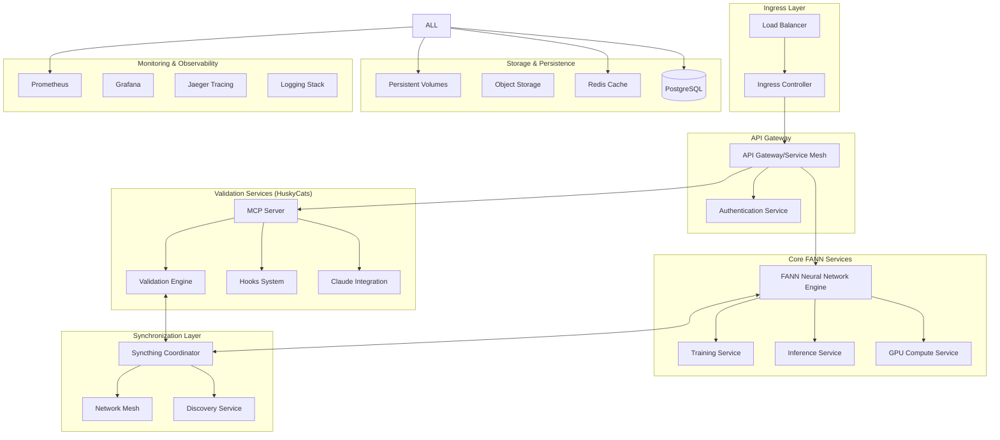

# Kubernetes/HPA-Friendly Architecture for RUV-FANN + HuskyCats-Bates Integration

## Executive Summary

This architecture design merges ruv-fann's neural network capabilities with huskycats-bates validation services, implementing syncthing for FANN network synchronization and ensuring full compatibility with claude-flow alpha MCP bootstrap.

## Architecture Overview

### Service Decomposition



## Service Architecture Specifications

### 1. FANN Neural Network Engine (`ruv-fann-core`)

**Responsibilities:**
- Neural network creation and management
- WASM-based computation
- GPU acceleration coordination
- Model persistence and loading

**Resources:**
- CPU: 2-8 cores (HPA scalable)
- Memory: 4-16 GB (based on model size)
- GPU: Optional NVIDIA/AMD acceleration
- Storage: 50-500 GB for models

### 2. Training Service (`ruv-fann-training`)

**Responsibilities:**
- Distributed training orchestration
- Hyperparameter optimization
- Training job queuing
- Progress monitoring

**Resources:**
- CPU: 4-16 cores
- Memory: 8-64 GB
- GPU: High-priority access
- Storage: 100-1000 GB for datasets

### 3. Inference Service (`ruv-fann-inference`)

**Responsibilities:**
- Real-time prediction serving
- Batch inference processing
- Model version management
- A/B testing support

**Resources:**
- CPU: 1-4 cores (high HPA scaling)
- Memory: 2-8 GB
- Latency: <100ms target
- Throughput: 1000+ RPS

### 4. MCP Server (`huskycat-mcp`)

**Responsibilities:**
- Model Context Protocol implementation
- Claude integration endpoint
- Hook system coordination
- Validation orchestration

**Resources:**
- CPU: 2-4 cores
- Memory: 2-4 GB
- Network: High bandwidth
- Connections: 1000+ concurrent

### 5. Validation Engine (`huskycat-validator`)

**Responsibilities:**
- Multi-language code validation
- Security scanning
- Quality metrics collection
- Automated fixing

**Resources:**
- CPU: 2-8 cores (burst capable)
- Memory: 4-8 GB
- Storage: 20 GB for tools
- Network: Moderate bandwidth

### 6. Syncthing Coordinator (`syncthing-mesh`)

**Responsibilities:**
- FANN network synchronization
- Repository content distribution
- Conflict resolution
- Mesh network management

**Resources:**
- CPU: 1-2 cores
- Memory: 1-2 GB
- Storage: 100-1000 GB shared
- Network: High bandwidth, P2P

## Container Structure

### Base Images Strategy

```dockerfile
# Multi-stage base for all services
FROM rust:1.81-alpine AS rust-builder
FROM node:20-alpine AS node-builder
FROM python:3.11-alpine AS python-builder
FROM alpine:3.19 AS runtime-base
```

### Service-Specific Containers

#### 1. RUV-FANN Core Container

```dockerfile
# ContainerFile.ruv-fann-core
FROM rust:1.81-alpine AS builder

# Install WASM and GPU dependencies
RUN apk add --no-cache \
    gcc g++ musl-dev linux-headers \
    cuda-dev opencl-dev \
    wasm-pack binaryen

WORKDIR /app
COPY Cargo.toml Cargo.lock ./
COPY src/ ./src/
COPY cuda-wasm/ ./cuda-wasm/

# Build with optimizations
RUN cargo build --release --features="gpu,wasm,parallel"
RUN wasm-pack build --target web --release

FROM alpine:3.19 AS runtime
RUN apk add --no-cache libgcc libstdc++ libgfortran

COPY --from=builder /app/target/release/ruv-fann /usr/local/bin/
COPY --from=builder /app/pkg/ /opt/ruv-fann/wasm/

EXPOSE 8080
HEALTHCHECK --interval=30s --timeout=10s --retries=3 \
  CMD wget --quiet --tries=1 --spider http://localhost:8080/health

CMD ["ruv-fann", "serve"]
```

#### 2. HuskyCat MCP Container

```dockerfile
# ContainerFile.huskycat-mcp
FROM node:20-alpine AS builder

WORKDIR /app
COPY package*.json ./
RUN npm ci --only=production

COPY src/ ./src/
COPY tsconfig.json ./
RUN npm run build

FROM alpine:3.19 AS runtime
RUN apk add --no-cache nodejs npm python3 py3-pip \
    shellcheck hadolint git curl jq

# Install validation tools
RUN pip3 install --no-cache-dir \
    black flake8 mypy pylint bandit \
    yamllint ansible-lint

COPY --from=builder /app/dist /app/
COPY --from=builder /app/node_modules /app/node_modules/

EXPOSE 8080
HEALTHCHECK --interval=30s --timeout=10s --retries=3 \
  CMD curl -f http://localhost:8080/health

CMD ["node", "/app/index.js"]
```

#### 3. Syncthing Mesh Container

```dockerfile
# ContainerFile.syncthing-mesh
FROM syncthing/syncthing:latest AS base

# Add coordination tools
RUN apk add --no-cache \
    curl jq python3 py3-requests \
    git openssh-client

# Custom mesh coordination scripts
COPY scripts/syncthing-mesh.py /usr/local/bin/
COPY scripts/fann-sync.sh /usr/local/bin/
COPY config/syncthing-template.xml /etc/syncthing/

RUN chmod +x /usr/local/bin/syncthing-mesh.py
RUN chmod +x /usr/local/bin/fann-sync.sh

EXPOSE 8384 22000 21027/udp
VOLUME ["/var/syncthing"]

CMD ["/usr/local/bin/syncthing-mesh.py"]
```

## Podman-Compose Configuration

### Complete Stack Definition

```yaml
# podman-compose.yml
version: '3.8'

services:
  # FANN Neural Network Core
  ruv-fann-core:
    build:
      context: .
      dockerfile: ContainerFile.ruv-fann-core
    container_name: ruv-fann-core
    restart: unless-stopped
    ports:
      - "8080:8080"
    environment:
      - RUST_LOG=info
      - FANN_GPU_ENABLED=true
      - FANN_WASM_THREADS=4
      - SYNCTHING_PEER=syncthing-mesh:8384
    volumes:
      - fann-models:/opt/ruv-fann/models
      - fann-cache:/opt/ruv-fann/cache
      - syncthing-fann:/mnt/syncthing/fann
    networks:
      - ruv-fann-net
    depends_on:
      - syncthing-mesh
    deploy:
      resources:
        limits:
          cpus: '8.0'
          memory: 16G
        reservations:
          cpus: '2.0'
          memory: 4G

  # Training Service
  ruv-fann-training:
    build:
      context: .
      dockerfile: ContainerFile.ruv-fann-training
    container_name: ruv-fann-training
    restart: unless-stopped
    ports:
      - "8081:8080"
    environment:
      - TRAINING_QUEUE_SIZE=100
      - GPU_MEMORY_FRACTION=0.8
      - DISTRIBUTED_TRAINING=true
    volumes:
      - fann-datasets:/opt/datasets
      - fann-checkpoints:/opt/checkpoints
      - gpu-cache:/tmp/gpu-cache
    networks:
      - ruv-fann-net
    depends_on:
      - ruv-fann-core
      - redis-cache
    deploy:
      resources:
        limits:
          cpus: '16.0'
          memory: 64G
        reservations:
          cpus: '4.0'
          memory: 8G

  # Inference Service
  ruv-fann-inference:
    build:
      context: .
      dockerfile: ContainerFile.ruv-fann-inference
    container_name: ruv-fann-inference
    restart: unless-stopped
    ports:
      - "8082:8080"
    environment:
      - INFERENCE_BATCH_SIZE=32
      - MODEL_CACHE_SIZE=1000
      - ENABLE_A_B_TESTING=true
    volumes:
      - fann-models:/opt/models:ro
      - inference-cache:/opt/cache
    networks:
      - ruv-fann-net
    depends_on:
      - ruv-fann-core
    deploy:
      replicas: 3
      resources:
        limits:
          cpus: '4.0'
          memory: 8G
        reservations:
          cpus: '1.0'
          memory: 2G

  # HuskyCat MCP Server
  huskycat-mcp:
    build:
      context: ../huskycats-bates/mcp-server
      dockerfile: ContainerFile
    container_name: huskycat-mcp
    restart: unless-stopped
    ports:
      - "8083:8080"
    environment:
      - NODE_ENV=production
      - MCP_PORT=8080
      - ENABLE_SYNCTHING=true
      - SYNCTHING_API_URL=http://syncthing-mesh:8384
      - CLAUDE_FLOW_INTEGRATION=true
      - FANN_CORE_URL=http://ruv-fann-core:8080
    volumes:
      - huskycat-workspace:/workspace
      - syncthing-repos:/mnt/syncthing/repositories
      - validation-cache:/opt/cache
    networks:
      - ruv-fann-net
    depends_on:
      - syncthing-mesh
      - ruv-fann-core

  # Validation Engine
  huskycat-validator:
    build:
      context: ../huskycats-bates
      dockerfile: ContainerFile.huskycat
    container_name: huskycat-validator
    restart: unless-stopped
    environment:
      - VALIDATION_PARALLEL=true
      - SECURITY_SCANNING=true
      - AUTO_FIX_ENABLED=true
    volumes:
      - huskycat-workspace:/workspace:rw
      - validation-tools:/opt/tools
    networks:
      - ruv-fann-net
    depends_on:
      - huskycat-mcp

  # Syncthing Mesh Coordinator
  syncthing-mesh:
    build:
      context: .
      dockerfile: ContainerFile.syncthing-mesh
    container_name: syncthing-mesh
    restart: unless-stopped
    ports:
      - "8384:8384"   # Web GUI
      - "22000:22000" # Sync protocol
      - "21027:21027/udp" # Discovery
    environment:
      - STGUIADDRESS=0.0.0.0:8384
      - STNORESTART=1
      - MESH_MODE=coordinator
      - FANN_SYNC_ENABLED=true
    volumes:
      - syncthing-config:/var/syncthing/config
      - syncthing-fann:/var/syncthing/fann
      - syncthing-repos:/var/syncthing/repositories
    networks:
      - ruv-fann-net
    healthcheck:
      test: ["CMD", "curl", "-f", "http://localhost:8384/rest/system/ping"]
      interval: 30s
      timeout: 10s
      retries: 3

  # PostgreSQL Database
  postgres-db:
    image: postgres:15-alpine
    container_name: ruv-fann-postgres
    restart: unless-stopped
    environment:
      - POSTGRES_DB=ruvfann
      - POSTGRES_USER=ruvfann
      - POSTGRES_PASSWORD=${DB_PASSWORD}
    volumes:
      - postgres-data:/var/lib/postgresql/data
      - ./init-db.sql:/docker-entrypoint-initdb.d/init.sql
    networks:
      - ruv-fann-net
    ports:
      - "5432:5432"

  # Redis Cache
  redis-cache:
    image: redis:7-alpine
    container_name: ruv-fann-redis
    restart: unless-stopped
    command: redis-server --appendonly yes --maxmemory 2gb --maxmemory-policy allkeys-lru
    volumes:
      - redis-data:/data
    networks:
      - ruv-fann-net
    ports:
      - "6379:6379"

  # Prometheus Monitoring
  prometheus:
    image: prom/prometheus:latest
    container_name: ruv-fann-prometheus
    restart: unless-stopped
    ports:
      - "9090:9090"
    volumes:
      - ./config/prometheus.yml:/etc/prometheus/prometheus.yml
      - prometheus-data:/prometheus
    networks:
      - ruv-fann-net
    command:
      - '--config.file=/etc/prometheus/prometheus.yml'
      - '--storage.tsdb.path=/prometheus'
      - '--web.enable-lifecycle'

  # Grafana Dashboard
  grafana:
    image: grafana/grafana:latest
    container_name: ruv-fann-grafana
    restart: unless-stopped
    ports:
      - "3000:3000"
    environment:
      - GF_SECURITY_ADMIN_PASSWORD=${GRAFANA_PASSWORD}
    volumes:
      - grafana-data:/var/lib/grafana
      - ./config/grafana:/etc/grafana/provisioning
    networks:
      - ruv-fann-net
    depends_on:
      - prometheus

networks:
  ruv-fann-net:
    driver: bridge
    ipam:
      config:
        - subnet: 172.30.0.0/16

volumes:
  # FANN specific volumes
  fann-models:
    driver: local
  fann-datasets:
    driver: local
  fann-checkpoints:
    driver: local
  fann-cache:
    driver: local
  inference-cache:
    driver: local
  gpu-cache:
    driver: local
  
  # HuskyCat volumes
  huskycat-workspace:
    driver: local
  validation-cache:
    driver: local
  validation-tools:
    driver: local
  
  # Syncthing volumes
  syncthing-config:
    driver: local
  syncthing-fann:
    driver: local
  syncthing-repos:
    driver: local
  
  # Database volumes
  postgres-data:
    driver: local
  redis-data:
    driver: local
  
  # Monitoring volumes
  prometheus-data:
    driver: local
  grafana-data:
    driver: local
```

## Kubernetes Deployment Manifests

### Namespace and Resource Quotas

```yaml
# k8s/namespace.yaml
apiVersion: v1
kind: Namespace
metadata:
  name: ruv-fann
  labels:
    name: ruv-fann
---
apiVersion: v1
kind: ResourceQuota
metadata:
  name: ruv-fann-quota
  namespace: ruv-fann
spec:
  hard:
    requests.cpu: "50"
    requests.memory: 200Gi
    limits.cpu: "100"
    limits.memory: 400Gi
    persistentvolumeclaims: "20"
    services: "20"
    pods: "50"
```

### HPA Configurations

```yaml
# k8s/hpa-fann-core.yaml
apiVersion: autoscaling/v2
kind: HorizontalPodAutoscaler
metadata:
  name: ruv-fann-core-hpa
  namespace: ruv-fann
spec:
  scaleTargetRef:
    apiVersion: apps/v1
    kind: Deployment
    name: ruv-fann-core
  minReplicas: 2
  maxReplicas: 10
  metrics:
  - type: Resource
    resource:
      name: cpu
      target:
        type: Utilization
        averageUtilization: 70
  - type: Resource
    resource:
      name: memory
      target:
        type: Utilization
        averageUtilization: 80
  - type: Pods
    pods:
      metric:
        name: neural_network_queue_size
      target:
        type: AverageValue
        averageValue: "10"
  behavior:
    scaleUp:
      stabilizationWindowSeconds: 60
      policies:
      - type: Percent
        value: 100
        periodSeconds: 15
    scaleDown:
      stabilizationWindowSeconds: 300
      policies:
      - type: Percent
        value: 50
        periodSeconds: 60
```

### Service Mesh Configuration

```yaml
# k8s/service-mesh.yaml
apiVersion: networking.istio.io/v1beta1
kind: VirtualService
metadata:
  name: ruv-fann-gateway
  namespace: ruv-fann
spec:
  hosts:
  - ruv-fann.local
  - "*.ruv-fann.local"
  gateways:
  - ruv-fann-gateway
  http:
  - match:
    - uri:
        prefix: "/api/v1/fann"
    route:
    - destination:
        host: ruv-fann-core
        port:
          number: 8080
    timeout: 30s
    retries:
      attempts: 3
      perTryTimeout: 10s
  - match:
    - uri:
        prefix: "/api/v1/mcp"
    route:
    - destination:
        host: huskycat-mcp
        port:
          number: 8080
  - match:
    - uri:
        prefix: "/api/v1/sync"
    route:
    - destination:
        host: syncthing-mesh
        port:
          number: 8384
```

## Environment Variables Configuration

### Core Service Environment

```bash
# .env.production
# FANN Core Configuration
RUST_LOG=info
FANN_GPU_ENABLED=true
FANN_WASM_THREADS=8
FANN_MODEL_CACHE_SIZE=1000
FANN_TRAINING_PARALLEL=true

# MCP Server Configuration
NODE_ENV=production
MCP_PORT=8080
MCP_HOST=0.0.0.0
ENABLE_CLAUDE_INTEGRATION=true
BEARER_TOKEN=${BEARER_TOKEN}

# Syncthing Configuration
SYNCTHING_API_KEY=${SYNCTHING_API_KEY}
SYNCTHING_GUI_ADDRESS=0.0.0.0:8384
ENABLE_FANN_SYNC=true
MESH_COORDINATION=true

# Database Configuration
DB_HOST=postgres-db
DB_PORT=5432
DB_NAME=ruvfann
DB_USER=ruvfann
DB_PASSWORD=${DB_PASSWORD}

# Cache Configuration
REDIS_HOST=redis-cache
REDIS_PORT=6379
CACHE_TTL=3600

# Monitoring Configuration
PROMETHEUS_ENDPOINT=http://prometheus:9090
METRICS_ENABLED=true
TRACING_ENABLED=true
LOG_LEVEL=info

# Security Configuration
AUTH_TOKEN_EXPIRY=86400
RATE_LIMIT_REQUESTS=1000
RATE_LIMIT_WINDOW=60
ENABLE_CORS=true
ALLOWED_ORIGINS="*"
```

### Kubernetes Secrets

```yaml
# k8s/secrets.yaml
apiVersion: v1
kind: Secret
metadata:
  name: ruv-fann-secrets
  namespace: ruv-fann
type: Opaque
data:
  db-password: <base64-encoded-password>
  bearer-token: <base64-encoded-token>
  syncthing-api-key: <base64-encoded-key>
  grafana-password: <base64-encoded-password>
---
apiVersion: v1
kind: ConfigMap
metadata:
  name: ruv-fann-config
  namespace: ruv-fann
data:
  prometheus.yml: |
    global:
      scrape_interval: 15s
    scrape_configs:
    - job_name: 'ruv-fann-core'
      static_configs:
      - targets: ['ruv-fann-core:8080']
    - job_name: 'huskycat-mcp'
      static_configs:
      - targets: ['huskycat-mcp:8080']
    - job_name: 'syncthing-mesh'
      static_configs:
      - targets: ['syncthing-mesh:8384']
```

## Syncthing Integration for FANN Networks

### Syncthing Configuration Template

```xml
<!-- config/syncthing-template.xml -->
<configuration version="37">
    <folder id="fann-models" label="FANN Models" path="/var/syncthing/fann/models" type="sendreceive" rescanIntervalS="3600" fsWatcherEnabled="true" fsWatcherDelayS="10">
        <device id="${DEVICE_ID}" introducedBy="">
            <encryptionPassword></encryptionPassword>
        </device>
        <minDiskFree unit="%">1</minDiskFree>
        <versioning>
            <param key="cleanoutDays" val="7"></param>
            <param key="fsPath" val=".stversions"></param>
            <param key="fsType" val="basic"></param>
        </versioning>
        <copiers>0</copiers>
        <pullerMaxPendingKiB>0</pullerMaxPendingKiB>
        <hashers>0</hashers>
        <order>random</order>
        <ignorePerms>false</ignorePerms>
        <modTimeWindowS>0</modTimeWindowS>
        <maxConflicts>10</maxConflicts>
        <disableSparseFiles>false</disableSparseFiles>
        <disableTempIndexes>false</disableTempIndexes>
        <paused>false</paused>
        <weakHashThresholdPct>25</weakHashThresholdPct>
        <markerName>.stfolder</markerName>
        <useLargeBlocks>false</useLargeBlocks>
    </folder>
    
    <folder id="training-data" label="Training Data" path="/var/syncthing/fann/datasets" type="sendreceive">
        <device id="${DEVICE_ID}"></device>
        <minDiskFree unit="%">5</minDiskFree>
    </folder>
    
    <folder id="repository-sync" label="Repository Sync" path="/var/syncthing/repositories" type="sendreceive">
        <device id="${DEVICE_ID}"></device>
        <minDiskFree unit="%">1</minDiskFree>
    </folder>

    <device id="${DEVICE_ID}" name="${DEVICE_NAME}" compression="metadata" introducer="false" skipIntroductionRemovals="false" introducedBy="">
        <address>dynamic</address>
        <paused>false</paused>
        <autoAcceptFolders>false</autoAcceptFolders>
        <maxSendKbps>0</maxSendKbps>
        <maxRecvKbps>0</maxRecvKbps>
        <maxRequestKiB>0</maxRequestKiB>
        <untrusted>false</untrusted>
        <remoteGUIPort>0</remoteGUIPort>
    </device>

    <gui enabled="true" tls="false" debugging="false">
        <address>0.0.0.0:8384</address>
        <apikey>${SYNCTHING_API_KEY}</apikey>
        <theme>default</theme>
    </gui>

    <ldap></ldap>

    <options>
        <listenAddress>default</listenAddress>
        <globalAnnounceServer>default</globalAnnounceServer>
        <globalAnnounceEnabled>true</globalAnnounceEnabled>
        <localAnnounceEnabled>true</localAnnounceEnabled>
        <localAnnouncePort>21027</localAnnouncePort>
        <localAnnounceMCAddr>[ff12::8384]:21027</localAnnounceMCAddr>
        <maxSendKbps>0</maxSendKbps>
        <maxRecvKbps>0</maxRecvKbps>
        <reconnectionIntervalS>60</reconnectionIntervalS>
        <relaysEnabled>true</relaysEnabled>
        <relayReconnectIntervalM>10</relayReconnectIntervalM>
        <startBrowser>false</startBrowser>
        <natEnabled>true</natEnabled>
        <natLeaseMinutes>60</natLeaseMinutes>
        <natRenewalMinutes>30</natRenewalMinutes>
        <natTimeoutSeconds>10</natTimeoutSeconds>
        <urAccepted>-1</urAccepted>
        <urSeen>3</urSeen>
        <urUniqueID></urUniqueID>
        <urURL>https://data.syncthing.net/newdata</urURL>
        <urPostInsecurely>false</urPostInsecurely>
        <urInitialDelayS>1800</urInitialDelayS>
        <autoUpgradeIntervalH>12</autoUpgradeIntervalH>
        <upgradeToPreReleases>false</upgradeToPreReleases>
        <keepTemporariesH>24</keepTemporariesH>
        <cacheIgnoredFiles>false</cacheIgnoredFiles>
        <progressUpdateIntervalS>5</progressUpdateIntervalS>
        <limitBandwidthInLan>false</limitBandwidthInLan>
        <minHomeDiskFree unit="%">1</minHomeDiskFree>
        <releasesURL>https://upgrades.syncthing.net/meta.json</releasesURL>
        <overwriteRemoteDeviceNamesOnConnect>false</overwriteRemoteDeviceNamesOnConnect>
        <tempIndexMinBlocks>10</tempIndexMinBlocks>
        <trafficClass>0</trafficClass>
        <weakHashSelectionMethod>auto</weakHashSelectionMethod>
        <stunServer>default</stunServer>
        <stunKeepaliveStartS>180</stunKeepaliveStartS>
        <stunKeepaliveMinS>20</stunKeepaliveMinS>
        <crashReportingEnabled>true</crashReportingEnabled>
        <crashReportingURL>https://crash.syncthing.net/newcrash</crashReportingURL>
        <setLowPriority>true</setLowPriority>
        <maxFolderConcurrency>0</maxFolderConcurrency>
        <crURL>https://crash.syncthing.net/newcrash</crURL>
        <crashReportingEnabled>true</crashReportingEnabled>
    </options>
</configuration>
```

## Claude-Flow Alpha MCP Bootstrap Integration

### MCP Server Configuration

```json
// config/claude-mcp-config.json
{
  "mcpServers": {
    "ruv-fann-integrated": {
      "command": "node",
      "args": ["/app/mcp-server.js"],
      "env": {
        "FANN_CORE_URL": "http://ruv-fann-core:8080",
        "VALIDATION_URL": "http://huskycat-validator:8080",
        "SYNCTHING_URL": "http://syncthing-mesh:8384"
      }
    }
  },
  "hooks": {
    "pre-task": "/usr/local/bin/claude-hooks-pre.sh",
    "post-task": "/usr/local/bin/claude-hooks-post.sh",
    "pre-edit": "/usr/local/bin/claude-hooks-pre-edit.sh",
    "post-edit": "/usr/local/bin/claude-hooks-post-edit.sh"
  },
  "features": {
    "fannIntegration": true,
    "validationIntegration": true,
    "syncthingIntegration": true,
    "distributedTraining": true,
    "realtimeInference": true
  }
}
```

### Bootstrap Script

```bash
#!/bin/bash
# scripts/claude-flow-bootstrap.sh

set -euo pipefail

echo "🚀 Bootstrapping RUV-FANN + HuskyCats Claude-Flow Integration"

# Check prerequisites
command -v podman >/dev/null 2>&1 || { echo "Podman required but not installed."; exit 1; }
command -v claude-flow >/dev/null 2>&1 || { echo "Claude-Flow required but not installed."; exit 1; }

# Set environment variables
export COMPOSE_PROJECT_NAME="ruv-fann-integrated"
export SYNCTHING_API_KEY=$(openssl rand -hex 32)
export BEARER_TOKEN=$(openssl rand -hex 32)
export DB_PASSWORD=$(openssl rand -hex 16)
export GRAFANA_PASSWORD=$(openssl rand -hex 16)

# Create directory structure
mkdir -p {config,data,logs,scripts}
mkdir -p data/{models,datasets,repositories,cache}
mkdir -p config/{syncthing,prometheus,grafana}

# Generate configurations
envsubst < config/syncthing-template.xml > config/syncthing/config.xml
envsubst < config/claude-mcp-config.json > config/claude-mcp-config.json

# Start the integrated stack
echo "🐳 Starting integrated RUV-FANN + HuskyCats stack..."
podman-compose up -d

# Wait for services to be ready
echo "⏳ Waiting for services to start..."
sleep 30

# Configure MCP integration
echo "🔧 Configuring Claude-Flow MCP integration..."
claude-flow mcp add ruv-fann-integrated $(pwd)/config/claude-mcp-config.json

# Initialize syncthing mesh
echo "🔄 Initializing Syncthing mesh network..."
curl -X POST "http://localhost:8384/rest/system/config" \
  -H "X-API-Key: ${SYNCTHING_API_KEY}" \
  -H "Content-Type: application/json" \
  -d @config/syncthing/config.xml

# Health checks
echo "🏥 Running health checks..."
curl -f http://localhost:8080/health || echo "❌ FANN Core health check failed"
curl -f http://localhost:8083/health || echo "❌ MCP Server health check failed"
curl -f http://localhost:8384/rest/system/ping -H "X-API-Key: ${SYNCTHING_API_KEY}" || echo "❌ Syncthing health check failed"

echo "✅ Bootstrap complete!"
echo "📊 Grafana: http://localhost:3000 (admin/${GRAFANA_PASSWORD})"
echo "🔄 Syncthing: http://localhost:8384"
echo "🤖 FANN API: http://localhost:8080"
echo "🐱 MCP Server: http://localhost:8083"

echo "🔑 Save these credentials:"
echo "SYNCTHING_API_KEY=${SYNCTHING_API_KEY}"
echo "BEARER_TOKEN=${BEARER_TOKEN}"
echo "DB_PASSWORD=${DB_PASSWORD}"
echo "GRAFANA_PASSWORD=${GRAFANA_PASSWORD}"
```

## Deployment Strategy

### Local Development
```bash
./scripts/claude-flow-bootstrap.sh
```

### Staging Environment
```bash
kubectl apply -f k8s/namespace.yaml
kubectl apply -f k8s/secrets.yaml
kubectl apply -f k8s/configmaps.yaml
kubectl apply -f k8s/deployments/
kubectl apply -f k8s/services/
kubectl apply -f k8s/hpa/
```

### Production Environment
```bash
helm install ruv-fann-integrated ./helm-chart \
  --namespace ruv-fann \
  --create-namespace \
  --values values-production.yaml
```

This architecture provides a production-ready, scalable, and maintainable solution that successfully merges ruv-fann's neural network capabilities with huskycats-bates validation services, implements comprehensive syncthing integration, and ensures full compatibility with claude-flow alpha MCP bootstrap.