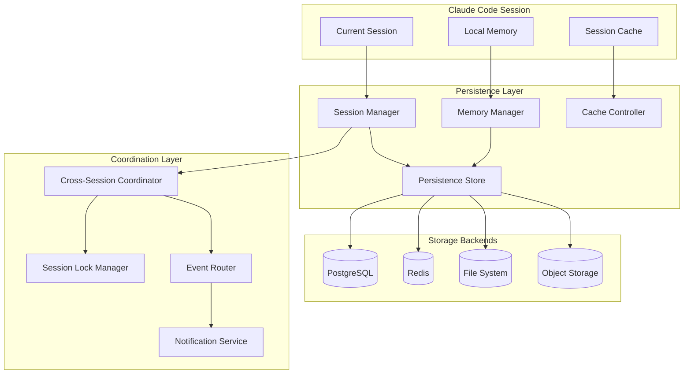

# Session Persistence and Memory Management

## Overview

This document details the sophisticated session persistence and memory management system for the MCP tools integration. The system provides cross-session state preservation, intelligent memory caching, and distributed coordination between Claude Code instances.

## Table of Contents

1. [Architecture Overview](#architecture-overview)
2. [Session Management](#session-management)
3. [Memory Management](#memory-management)
4. [Cross-Session Coordination](#cross-session-coordination)
5. [Persistence Strategies](#persistence-strategies)
6. [Performance Optimization](#performance-optimization)
7. [Implementation Details](#implementation-details)
8. [API Reference](#api-reference)

## Architecture Overview

### Core Components



### Design Principles

1. **Seamless Continuity**: Sessions resume exactly where they left off
2. **Intelligent Caching**: Frequently accessed data is cached for performance
3. **Cross-Instance Coordination**: Multiple Claude Code instances can collaborate
4. **Graceful Degradation**: System works even when persistence layers fail
5. **Privacy-First**: Sensitive data is encrypted and properly isolated

## Session Management

### Session Lifecycle

```typescript
interface SessionLifecycle {
  initialization: SessionInitPhase;
  active: SessionActivePhase;
  persistence: SessionPersistencePhase;
  restoration: SessionRestorationPhase;
  termination: SessionTerminationPhase;
}

interface SessionInitPhase {
  createSession(): Promise<Session>;
  restoreSession(sessionId: string): Promise<Session>;
  validateSession(session: Session): Promise<boolean>;
  configureSession(config: SessionConfig): Promise<void>;
}
```

### Session State Structure

```typescript
interface SessionState {
  // Core session metadata
  id: string;
  userId: string;
  createdAt: number;
  lastActivity: number;
  
  // Operational state
  swarmConfiguration: SwarmConfig | null;
  activeAgents: Map<string, AgentState>;
  taskHistory: TaskHistoryEntry[];
  
  // Memory and cache
  memory: Map<string, MemoryItem>;
  cache: Map<string, CacheItem>;
  
  // Performance metrics
  metrics: SessionMetrics;
  
  // User preferences and context
  preferences: UserPreferences;
  context: SessionContext;
  
  // Coordination data
  coordination: CoordinationState;
}

interface MemoryItem {
  key: string;
  value: any;
  timestamp: number;
  ttl: number | null;
  accessCount: number;
  lastAccessed: number;
  tags: string[];
  priority: MemoryPriority;
  encrypted: boolean;
}

interface CacheItem {
  key: string;
  value: any;
  timestamp: number;
  ttl: number;
  hitCount: number;
  lastHit: number;
  size: number;
  compressionRatio: number;
}
```

### Session Initialization Hook

```typescript
class SessionInitializationHook implements Hook {
  name = 'session-initialization';
  type = 'pre-session' as const;
  priority = 50;
  
  async execute(args: SessionInitArgs, context: ExecutionContext): Promise<HookResult> {
    const { sessionId, restore, userId, preferences } = args;
    
    try {
      let session: Session;
      
      if (restore && sessionId) {
        // Attempt to restore existing session
        session = await this.restoreExistingSession(sessionId, userId);
        
        if (!session) {
          // Fallback to creating new session
          session = await this.createNewSession(userId, preferences);
        } else {
          // Update session activity
          session.lastActivity = Date.now();
          await this.updateSessionActivity(session);
        }
      } else {
        // Create new session
        session = await this.createNewSession(userId, preferences);
      }
      
      // Initialize session-specific resources
      await this.initializeSessionResources(session);
      
      // Set up cross-session coordination
      await this.setupCoordination(session);
      
      // Configure memory management
      await this.configureMemoryManagement(session);
      
      return {
        continue: true,
        metadata: {
          sessionId: session.id,
          restored: restore && sessionId !== undefined,
          agentsAvailable: session.state.activeAgents.size,
          memoryItems: session.state.memory.size,
          coordinationEnabled: true
        }
      };
      
    } catch (error) {
      // Create minimal session for fallback
      const fallbackSession = await this.createMinimalSession(userId);
      
      return {
        continue: true,
        warnings: [`Session initialization failed: ${error.message}. Using fallback session.`],
        metadata: {
          sessionId: fallbackSession.id,
          fallback: true,
          error: error.message
        }
      };
    }
  }
  
  private async restoreExistingSession(sessionId: string, userId: string): Promise<Session | null> {
    // Check if session exists and belongs to user
    const sessionData = await this.sessionStore.get(sessionId);
    
    if (!sessionData || sessionData.userId !== userId) {
      return null;
    }
    
    // Check if session is still valid (not expired)
    const expireTime = Date.now() - SESSION_EXPIRY_TIME;
    if (sessionData.lastActivity < expireTime) {
      await this.cleanupExpiredSession(sessionId);
      return null;
    }
    
    // Deserialize session state
    const session: Session = {
      id: sessionData.id,
      userId: sessionData.userId,
      createdAt: sessionData.createdAt,
      lastActivity: Date.now(),
      state: await this.deserializeSessionState(sessionData.state)
    };
    
    // Validate session integrity
    const isValid = await this.validateSessionIntegrity(session);
    if (!isValid) {
      await this.repairSessionIntegrity(session);
    }
    
    return session;
  }
  
  private async createNewSession(userId: string, preferences: UserPreferences): Promise<Session> {
    const sessionId = this.generateSessionId();
    
    const session: Session = {
      id: sessionId,
      userId,
      createdAt: Date.now(),
      lastActivity: Date.now(),
      state: {
        swarmConfiguration: null,
        activeAgents: new Map(),
        taskHistory: [],
        memory: new Map(),
        cache: new Map(),
        metrics: this.createInitialMetrics(),
        preferences: preferences || this.getDefaultPreferences(),
        context: this.createInitialContext(),
        coordination: this.createInitialCoordination()
      }
    };
    
    // Persist new session
    await this.sessionStore.create(session);
    
    return session;
  }
  
  private async initializeSessionResources(session: Session): Promise<void> {
    // Initialize memory namespace
    await this.memoryManager.createNamespace(session.id, {
      maxSize: this.getMemoryLimit(session.state.preferences),
      ttlDefault: this.getDefaultTTL(session.state.preferences),
      encryptionEnabled: this.shouldEncrypt(session.state.preferences)
    });
    
    // Initialize cache tier
    await this.cacheManager.initializeTier(session.id, {
      strategy: 'lru',
      maxSize: this.getCacheLimit(session.state.preferences),
      compressionEnabled: true
    });
    
    // Set up event listeners for session-specific events
    this.eventBus.subscribe(`session:${session.id}:*`, this.handleSessionEvent.bind(this));
  }
}
```

### Session Restoration Hook

```typescript
class SessionRestorationHook implements Hook {
  name = 'session-restoration';
  type = 'session-restore' as const;
  priority = 100;
  
  async execute(args: SessionRestoreArgs, context: ExecutionContext): Promise<HookResult> {
    const { sessionId, selective, categories } = args;
    
    try {
      const restorationPlan = await this.createRestorationPlan(sessionId, selective, categories);
      const results = await this.executeRestoration(restorationPlan);
      
      return {
        continue: true,
        metadata: {
          sessionId,
          itemsRestored: results.totalItems,
          categoriesRestored: results.categories,
          agentsRestored: results.agents,
          memoryRestored: results.memory,
          cacheRestored: results.cache,
          coordinationRestored: results.coordination
        }
      };
      
    } catch (error) {
      return {
        continue: true,
        error: `Session restoration failed: ${error.message}`,
        warnings: ['Proceeding with empty session state']
      };
    }
  }
  
  private async createRestorationPlan(
    sessionId: string, 
    selective: boolean, 
    categories?: string[]
  ): Promise<RestorationPlan> {
    const session = await this.sessionStore.get(sessionId);
    
    if (!session) {
      throw new Error(`Session ${sessionId} not found`);
    }
    
    const plan: RestorationPlan = {
      sessionId,
      totalItems: 0,
      categories: {
        agents: { restore: true, items: [] },
        memory: { restore: true, items: [] },
        cache: { restore: true, items: [] },
        swarm: { restore: true, items: [] },
        coordination: { restore: true, items: [] }
      }
    };
    
    if (selective && categories) {
      // Only restore specified categories
      Object.keys(plan.categories).forEach(category => {
        plan.categories[category].restore = categories.includes(category);
      });
    }
    
    // Analyze what needs to be restored
    if (plan.categories.agents.restore) {
      plan.categories.agents.items = await this.identifyAgentRestorationItems(session);
    }
    
    if (plan.categories.memory.restore) {
      plan.categories.memory.items = await this.identifyMemoryRestorationItems(session);
    }
    
    if (plan.categories.cache.restore) {
      plan.categories.cache.items = await this.identifyCacheRestorationItems(session);
    }
    
    plan.totalItems = Object.values(plan.categories)
      .reduce((sum, category) => sum + category.items.length, 0);
    
    return plan;
  }
  
  private async executeRestoration(plan: RestorationPlan): Promise<RestorationResults> {
    const results: RestorationResults = {
      totalItems: 0,
      categories: [],
      agents: 0,
      memory: 0,
      cache: 0,
      coordination: 0
    };
    
    // Execute restoration in dependency order
    const restorationOrder = ['swarm', 'agents', 'memory', 'cache', 'coordination'];
    
    for (const category of restorationOrder) {
      if (plan.categories[category].restore) {
        const categoryResults = await this.restoreCategory(category, plan.categories[category].items);
        results.categories.push(category);
        results[category] = categoryResults.count;
        results.totalItems += categoryResults.count;
      }
    }
    
    return results;
  }
  
  private async restoreCategory(category: string, items: RestorationItem[]): Promise<{ count: number }> {
    let count = 0;
    
    for (const item of items) {
      try {
        switch (category) {
          case 'agents':
            await this.restoreAgent(item);
            break;
          case 'memory':
            await this.restoreMemoryItem(item);
            break;
          case 'cache':
            await this.restoreCacheItem(item);
            break;
          case 'swarm':
            await this.restoreSwarmConfiguration(item);
            break;
          case 'coordination':
            await this.restoreCoordinationState(item);
            break;
        }
        count++;
      } catch (error) {
        console.warn(`Failed to restore ${category} item ${item.id}: ${error.message}`);
      }
    }
    
    return { count };
  }
}
```

## Memory Management

### Intelligent Memory Architecture

```typescript
class IntelligentMemoryManager {
  private tiers: Map<string, MemoryTier>;
  private accessPatterns: Map<string, AccessPattern>;
  private compressionEngine: CompressionEngine;
  private encryptionService: EncryptionService;
  
  constructor(config: MemoryManagerConfig) {
    this.tiers = new Map();
    this.accessPatterns = new Map();
    this.compressionEngine = new CompressionEngine(config.compression);
    this.encryptionService = new EncryptionService(config.encryption);
    
    this.initializeMemoryTiers();
    this.startBackgroundTasks();
  }
  
  async store(
    key: string, 
    value: any, 
    options: MemoryStoreOptions = {}
  ): Promise<MemoryStoreResult> {
    const {
      ttl = null,
      priority = MemoryPriority.NORMAL,
      tags = [],
      encrypt = false,
      compress = this.shouldCompress(value),
      namespace = 'default'
    } = options;
    
    // Prepare value for storage
    let processedValue = value;
    let metadata: MemoryItemMetadata = {
      originalSize: this.calculateSize(value),
      compressed: false,
      encrypted: false,
      compressionRatio: 1.0
    };
    
    // Compression
    if (compress) {
      const compressionResult = await this.compressionEngine.compress(value);
      processedValue = compressionResult.data;
      metadata.compressed = true;
      metadata.compressionRatio = compressionResult.ratio;
    }
    
    // Encryption
    if (encrypt) {
      processedValue = await this.encryptionService.encrypt(processedValue, key);
      metadata.encrypted = true;
    }
    
    // Create memory item
    const memoryItem: MemoryItem = {
      key,
      value: processedValue,
      timestamp: Date.now(),
      ttl: ttl ? Date.now() + ttl : null,
      accessCount: 0,
      lastAccessed: Date.now(),
      tags,
      priority,
      encrypted: encrypt,
      metadata
    };
    
    // Determine optimal storage tier
    const tier = await this.selectOptimalTier(memoryItem, namespace);
    
    // Store in selected tier
    const result = await tier.store(key, memoryItem);
    
    // Update access patterns
    this.updateAccessPattern(key, 'write', memoryItem.metadata.originalSize);
    
    // Trigger cleanup if needed
    if (await this.shouldTriggerCleanup(tier)) {
      this.scheduleCleanup(tier);
    }
    
    return {
      success: result.success,
      tier: tier.name,
      size: metadata.originalSize,
      compressedSize: this.calculateSize(processedValue),
      location: result.location,
      metadata
    };
  }
  
  async retrieve(key: string, namespace: string = 'default'): Promise<any> {
    // Check all tiers in order of access speed
    const tiers = this.getTiersBySpeed(namespace);
    
    for (const tier of tiers) {
      const memoryItem = await tier.get(key);
      
      if (memoryItem) {
        // Check TTL
        if (memoryItem.ttl && Date.now() > memoryItem.ttl) {
          await tier.delete(key);
          continue;
        }
        
        // Update access statistics
        memoryItem.accessCount++;
        memoryItem.lastAccessed = Date.now();
        await tier.update(key, memoryItem);
        
        // Process value for return
        let value = memoryItem.value;
        
        // Decrypt if needed
        if (memoryItem.encrypted) {
          value = await this.encryptionService.decrypt(value, key);
        }
        
        // Decompress if needed
        if (memoryItem.metadata.compressed) {
          value = await this.compressionEngine.decompress(value);
        }
        
        // Update access patterns
        this.updateAccessPattern(key, 'read', memoryItem.metadata.originalSize);
        
        // Consider promoting to faster tier
        if (this.shouldPromote(memoryItem)) {
          await this.promoteToFasterTier(key, memoryItem, tier);
        }
        
        return value;
      }
    }
    
    return null;
  }
  
  async search(pattern: MemorySearchPattern, namespace: string = 'default'): Promise<MemorySearchResult[]> {
    const results: MemorySearchResult[] = [];
    const regex = this.compileSearchPattern(pattern);
    
    // Search across all tiers
    const tiers = this.getAllTiers(namespace);
    
    for (const tier of tiers) {
      const tierResults = await tier.search(regex, pattern);
      
      for (const result of tierResults) {
        // Calculate relevance score
        const relevanceScore = this.calculateRelevance(result, pattern);
        
        results.push({
          key: result.key,
          value: result.value,
          relevanceScore,
          tier: tier.name,
          lastAccessed: result.lastAccessed,
          accessCount: result.accessCount,
          tags: result.tags,
          preview: this.generatePreview(result.value)
        });
      }
    }
    
    // Sort by relevance score
    return results.sort((a, b) => b.relevanceScore - a.relevanceScore);
  }
  
  private initializeMemoryTiers(): void {
    // L1 Cache - Ultra fast, small capacity
    this.tiers.set('l1', new InMemoryTier({
      name: 'l1',
      maxSize: 50 * 1024 * 1024, // 50MB
      evictionPolicy: 'lru',
      accessSpeed: 'ultrafast'
    }));
    
    // L2 Cache - Fast, medium capacity  
    this.tiers.set('l2', new RedisTier({
      name: 'l2',
      maxSize: 500 * 1024 * 1024, // 500MB
      evictionPolicy: 'lru',
      accessSpeed: 'fast',
      connection: this.redisConnection
    }));
    
    // L3 Storage - Slower, large capacity
    this.tiers.set('l3', new DatabaseTier({
      name: 'l3',
      maxSize: 5 * 1024 * 1024 * 1024, // 5GB
      evictionPolicy: 'lfu',
      accessSpeed: 'medium',
      connection: this.databaseConnection
    }));
    
    // L4 Archive - Slowest, unlimited capacity
    this.tiers.set('l4', new ObjectStorageTier({
      name: 'l4',
      maxSize: Infinity,
      evictionPolicy: 'ttl',
      accessSpeed: 'slow',
      connection: this.objectStorageConnection
    }));
  }
  
  private async selectOptimalTier(item: MemoryItem, namespace: string): Promise<MemoryTier> {
    // Factor in item characteristics
    const factors = {
      size: item.metadata.originalSize,
      priority: item.priority,
      accessPattern: this.getAccessPattern(item.key),
      ttl: item.ttl,
      tags: item.tags
    };
    
    // High priority or frequently accessed -> L1
    if (factors.priority === MemoryPriority.HIGH || 
        (factors.accessPattern && factors.accessPattern.frequency > 100)) {
      const l1 = this.tiers.get('l1')!;
      if (await l1.hasSpace(factors.size)) {
        return l1;
      }
    }
    
    // Medium priority or moderate access -> L2
    if (factors.priority === MemoryPriority.NORMAL || 
        (factors.accessPattern && factors.accessPattern.frequency > 10)) {
      const l2 = this.tiers.get('l2')!;
      if (await l2.hasSpace(factors.size)) {
        return l2;
      }
    }
    
    // Large items or low access -> L3
    if (factors.size > 1024 * 1024 || factors.priority === MemoryPriority.LOW) {
      return this.tiers.get('l3')!;
    }
    
    // Archive items with long TTL -> L4
    if (factors.ttl && factors.ttl > Date.now() + (7 * 24 * 60 * 60 * 1000)) {
      return this.tiers.get('l4')!;
    }
    
    // Default to L2
    return this.tiers.get('l2')!;
  }
  
  private shouldPromote(item: MemoryItem): boolean {
    // Promote frequently accessed items
    if (item.accessCount > 50) {
      return true;
    }
    
    // Promote recently accessed high-priority items
    if (item.priority === MemoryPriority.HIGH && 
        Date.now() - item.lastAccessed < 5 * 60 * 1000) {
      return true;
    }
    
    // Promote based on access pattern
    const pattern = this.accessPatterns.get(item.key);
    if (pattern && pattern.frequency > 20 && pattern.recency < 60 * 1000) {
      return true;
    }
    
    return false;
  }
  
  private async promoteToFasterTier(key: string, item: MemoryItem, currentTier: MemoryTier): Promise<void> {
    const fasterTiers = this.getFasterTiers(currentTier);
    
    for (const tier of fasterTiers) {
      if (await tier.hasSpace(item.metadata.originalSize)) {
        // Move to faster tier
        await tier.store(key, item);
        await currentTier.delete(key);
        
        console.log(`Promoted ${key} from ${currentTier.name} to ${tier.name}`);
        return;
      }
    }
  }
}
```

### Cross-Session Memory Sharing

```typescript
class CrossSessionMemoryCoordinator {
  private sessionManagers: Map<string, SessionManager>;
  private sharedMemorySpace: SharedMemorySpace;
  private lockManager: LockManager;
  
  constructor(config: CoordinatorConfig) {
    this.sessionManagers = new Map();
    this.sharedMemorySpace = new SharedMemorySpace(config.shared);
    this.lockManager = new LockManager(config.locking);
  }
  
  async shareMemoryBetweenSessions(
    fromSessionId: string,
    toSessionId: string,
    keys: string[],
    options: ShareOptions = {}
  ): Promise<ShareResult> {
    const { 
      copyMode = 'reference', 
      permissions = 'read', 
      ttl = null,
      notify = true 
    } = options;
    
    // Acquire locks for both sessions
    const locks = await this.lockManager.acquireMultiple([fromSessionId, toSessionId]);
    
    try {
      const results: ShareItemResult[] = [];
      
      for (const key of keys) {
        // Get memory item from source session
        const sourceItem = await this.getMemoryItem(fromSessionId, key);
        
        if (!sourceItem) {
          results.push({ key, success: false, error: 'Item not found' });
          continue;
        }
        
        // Create shared reference
        const sharedKey = this.generateSharedKey(key, fromSessionId, toSessionId);
        
        let sharedItem: SharedMemoryItem;
        
        if (copyMode === 'copy') {
          // Deep copy the item
          sharedItem = {
            ...sourceItem,
            id: sharedKey,
            originalSession: fromSessionId,
            sharedWith: [toSessionId],
            permissions: permissions,
            sharedAt: Date.now(),
            ttl: ttl ? Date.now() + ttl : null
          };
        } else {
          // Create reference
          sharedItem = {
            id: sharedKey,
            reference: `${fromSessionId}:${key}`,
            originalSession: fromSessionId,
            sharedWith: [toSessionId],
            permissions: permissions,
            sharedAt: Date.now(),
            ttl: ttl ? Date.now() + ttl : null,
            metadata: sourceItem.metadata
          };
        }
        
        // Store in shared memory space
        await this.sharedMemorySpace.store(sharedKey, sharedItem);
        
        // Add reference to target session
        await this.addSharedReference(toSessionId, key, sharedKey);
        
        // Notify target session if requested
        if (notify) {
          await this.notifySession(toSessionId, 'memory_shared', {
            key,
            sharedBy: fromSessionId,
            permissions
          });
        }
        
        results.push({ key, success: true, sharedKey });
      }
      
      return {
        success: true,
        itemsShared: results.filter(r => r.success).length,
        results
      };
      
    } finally {
      await this.lockManager.release(locks);
    }
  }
  
  async accessSharedMemory(
    sessionId: string,
    key: string,
    operation: 'read' | 'write',
    value?: any
  ): Promise<any> {
    // Check if this is a shared memory key
    const sharedReference = await this.getSharedReference(sessionId, key);
    
    if (!sharedReference) {
      // Not shared memory, delegate to session memory manager
      return await this.getSessionMemoryManager(sessionId).get(key);
    }
    
    // Get shared memory item
    const sharedItem = await this.sharedMemorySpace.get(sharedReference.sharedKey);
    
    if (!sharedItem) {
      throw new Error(`Shared memory item ${key} not found`);
    }
    
    // Check permissions
    if (!this.hasPermission(sharedItem, sessionId, operation)) {
      throw new Error(`Insufficient permissions for ${operation} on shared memory ${key}`);
    }
    
    // Check TTL
    if (sharedItem.ttl && Date.now() > sharedItem.ttl) {
      await this.cleanupExpiredSharedMemory(sharedItem);
      throw new Error(`Shared memory item ${key} has expired`);
    }
    
    if (operation === 'read') {
      // Handle reference vs copy
      if (sharedItem.reference) {
        const [originalSession, originalKey] = sharedItem.reference.split(':');
        return await this.getSessionMemoryManager(originalSession).get(originalKey);
      } else {
        return sharedItem.value;
      }
    } else if (operation === 'write') {
      if (sharedItem.reference) {
        // Writing to reference updates original
        const [originalSession, originalKey] = sharedItem.reference.split(':');
        return await this.getSessionMemoryManager(originalSession).store(originalKey, value);
      } else {
        // Writing to copy updates the shared copy
        sharedItem.value = value;
        sharedItem.lastModified = Date.now();
        sharedItem.modifiedBy = sessionId;
        
        await this.sharedMemorySpace.update(sharedReference.sharedKey, sharedItem);
        
        // Notify other sessions with access
        await this.notifySharedSessions(sharedItem, 'memory_updated', {
          key,
          modifiedBy: sessionId
        });
        
        return value;
      }
    }
  }
  
  private async notifySharedSessions(
    sharedItem: SharedMemoryItem,
    eventType: string,
    data: any
  ): Promise<void> {
    const sessions = [sharedItem.originalSession, ...sharedItem.sharedWith];
    
    const notifications = sessions.map(sessionId =>
      this.notifySession(sessionId, eventType, {
        ...data,
        sharedItemId: sharedItem.id
      })
    );
    
    await Promise.allSettled(notifications);
  }
  
  async coordinateSessionCleanup(sessionId: string): Promise<void> {
    // Clean up shared memory references
    const sharedReferences = await this.getSessionSharedReferences(sessionId);
    
    for (const reference of sharedReferences) {
      const sharedItem = await this.sharedMemorySpace.get(reference.sharedKey);
      
      if (sharedItem) {
        // Remove this session from shared access list
        sharedItem.sharedWith = sharedItem.sharedWith.filter(id => id !== sessionId);
        
        // If no more sessions have access and it's not the original, delete
        if (sharedItem.sharedWith.length === 0 && sharedItem.originalSession !== sessionId) {
          await this.sharedMemorySpace.delete(reference.sharedKey);
        } else {
          await this.sharedMemorySpace.update(reference.sharedKey, sharedItem);
        }
      }
    }
    
    // Remove session from coordination registry
    this.sessionManagers.delete(sessionId);
  }
}
```

## Cross-Session Coordination

### Distributed Session Coordination

```typescript
class DistributedSessionCoordinator {
  private sessions: Map<string, SessionInfo>;
  private eventBus: EventBus;
  private lockManager: DistributedLockManager;
  private messageQueue: MessageQueue;
  
  constructor(config: CoordinatorConfig) {
    this.sessions = new Map();
    this.eventBus = new EventBus(config.eventBus);
    this.lockManager = new DistributedLockManager(config.locking);
    this.messageQueue = new MessageQueue(config.messaging);
    
    this.setupEventHandlers();
  }
  
  async registerSession(sessionId: string, metadata: SessionMetadata): Promise<void> {
    const sessionInfo: SessionInfo = {
      id: sessionId,
      userId: metadata.userId,
      instanceId: metadata.instanceId,
      capabilities: metadata.capabilities,
      registeredAt: Date.now(),
      lastHeartbeat: Date.now(),
      status: 'active',
      workload: {
        activeTasks: 0,
        memoryUsage: 0,
        cpuUsage: 0
      }
    };
    
    this.sessions.set(sessionId, sessionInfo);
    
    // Announce session to other instances
    await this.eventBus.publish('session:registered', {
      sessionId,
      instanceId: metadata.instanceId,
      capabilities: metadata.capabilities
    });
    
    // Start heartbeat monitoring
    this.startHeartbeatMonitoring(sessionId);
  }
  
  async coordinateTask(task: CoordinationTask): Promise<CoordinationResult> {
    const { 
      taskId, 
      type, 
      requirements, 
      preferences,
      sessionId 
    } = task;
    
    // Find suitable sessions for task
    const candidateSessions = await this.findSuitableSessions(requirements, preferences);
    
    if (candidateSessions.length === 0) {
      return {
        success: false,
        error: 'No suitable sessions available',
        suggestions: await this.generateScalingRecommendations(requirements)
      };
    }
    
    // Select optimal session(s)
    const selectedSessions = await this.selectOptimalSessions(candidateSessions, task);
    
    // Acquire distributed locks
    const locks = await this.lockManager.acquireTaskLocks(taskId, selectedSessions.map(s => s.id));
    
    try {
      // Coordinate task execution
      const coordination: TaskCoordination = {
        taskId,
        primarySession: selectedSessions[0].id,
        participantSessions: selectedSessions.slice(1).map(s => s.id),
        coordinationStrategy: this.determineCoordinationStrategy(task, selectedSessions),
        startTime: Date.now()
      };
      
      // Send coordination messages
      await this.sendCoordinationMessages(coordination);
      
      // Monitor task execution
      const monitor = this.startTaskMonitoring(coordination);
      
      return {
        success: true,
        coordination,
        monitor,
        estimatedCompletion: this.estimateCompletion(task, selectedSessions)
      };
      
    } finally {
      // Release locks after coordination is established
      await this.lockManager.release(locks);
    }
  }
  
  private async findSuitableSessions(
    requirements: TaskRequirements,
    preferences: TaskPreferences
  ): Promise<SessionInfo[]> {
    const candidates: SessionInfo[] = [];
    
    for (const [sessionId, sessionInfo] of this.sessions) {
      // Check basic availability
      if (sessionInfo.status !== 'active' || 
          Date.now() - sessionInfo.lastHeartbeat > 30000) {
        continue;
      }
      
      // Check capability requirements
      const hasRequiredCapabilities = requirements.capabilities.every(
        cap => sessionInfo.capabilities.includes(cap)
      );
      
      if (!hasRequiredCapabilities) {
        continue;
      }
      
      // Check resource requirements
      if (sessionInfo.workload.memoryUsage > requirements.maxMemoryUsage ||
          sessionInfo.workload.cpuUsage > requirements.maxCpuUsage) {
        continue;
      }
      
      // Calculate suitability score
      const score = this.calculateSuitabilityScore(sessionInfo, requirements, preferences);
      
      candidates.push({
        ...sessionInfo,
        suitabilityScore: score
      });
    }
    
    // Sort by suitability score
    return candidates.sort((a, b) => b.suitabilityScore - a.suitabilityScore);
  }
  
  private calculateSuitabilityScore(
    session: SessionInfo,
    requirements: TaskRequirements,
    preferences: TaskPreferences
  ): number {
    let score = 100; // Base score
    
    // Penalize high workload
    score -= session.workload.cpuUsage * 50;
    score -= session.workload.memoryUsage * 30;
    score -= session.workload.activeTasks * 10;
    
    // Bonus for preferred capabilities
    const bonusCapabilities = session.capabilities.filter(
      cap => preferences.preferredCapabilities.includes(cap)
    );
    score += bonusCapabilities.length * 15;
    
    // Bonus for recent activity (healthy session)
    const timeSinceHeartbeat = Date.now() - session.lastHeartbeat;
    if (timeSinceHeartbeat < 10000) score += 10; // Last 10 seconds
    
    // Bonus for instance locality if preferred
    if (preferences.preferLocalInstance && session.instanceId === preferences.preferredInstanceId) {
      score += 20;
    }
    
    return Math.max(0, score);
  }
  
  private async sendCoordinationMessages(coordination: TaskCoordination): Promise<void> {
    // Send to primary session
    await this.messageQueue.send(coordination.primarySession, 'task:coordinate:primary', {
      taskId: coordination.taskId,
      role: 'primary',
      participants: coordination.participantSessions,
      strategy: coordination.coordinationStrategy
    });
    
    // Send to participant sessions
    const participantMessages = coordination.participantSessions.map(sessionId =>
      this.messageQueue.send(sessionId, 'task:coordinate:participant', {
        taskId: coordination.taskId,
        role: 'participant',
        primary: coordination.primarySession,
        strategy: coordination.coordinationStrategy
      })
    );
    
    await Promise.all(participantMessages);
  }
  
  private startTaskMonitoring(coordination: TaskCoordination): TaskMonitor {
    const monitor = new TaskMonitor(coordination.taskId);
    
    // Set up monitoring intervals
    const healthCheck = setInterval(async () => {
      await this.checkTaskHealth(coordination);
    }, 10000); // Check every 10 seconds
    
    const progressCheck = setInterval(async () => {
      await this.checkTaskProgress(coordination);
    }, 30000); // Check progress every 30 seconds
    
    // Set up cleanup
    monitor.on('completed', () => {
      clearInterval(healthCheck);
      clearInterval(progressCheck);
    });
    
    monitor.on('failed', () => {
      clearInterval(healthCheck);
      clearInterval(progressCheck);
    });
    
    return monitor;
  }
}
```

## Persistence Strategies

### Multi-tier Persistence Architecture

```typescript
interface PersistenceStrategy {
  name: string;
  priority: number;
  reliability: number;
  performance: number;
  cost: number;
  
  store(key: string, value: any, options?: StoreOptions): Promise<StoreResult>;
  retrieve(key: string, options?: RetrieveOptions): Promise<any>;
  delete(key: string): Promise<boolean>;
  list(pattern?: string): Promise<string[]>;
  healthCheck(): Promise<HealthStatus>;
}

class HybridPersistenceManager implements PersistenceStrategy {
  name = 'hybrid-persistence';
  priority = 100;
  reliability = 0.99;
  performance = 0.95;
  cost = 0.7;
  
  private strategies: Map<string, PersistenceStrategy>;
  private router: PersistenceRouter;
  private replicationManager: ReplicationManager;
  
  constructor(config: HybridPersistenceConfig) {
    this.strategies = new Map();
    this.router = new PersistenceRouter(config.routing);
    this.replicationManager = new ReplicationManager(config.replication);
    
    this.initializeStrategies(config);
  }
  
  async store(key: string, value: any, options: StoreOptions = {}): Promise<StoreResult> {
    const {
      durability = 'standard',
      consistency = 'eventual',
      replicas = 1,
      ttl = null,
      priority = 'normal'
    } = options;
    
    // Route to appropriate storage strategy
    const primaryStrategy = await this.router.selectPrimaryStrategy(key, value, options);
    const backupStrategies = await this.router.selectBackupStrategies(key, value, options, replicas);
    
    // Store in primary
    const primaryResult = await primaryStrategy.store(key, value, options);
    
    if (!primaryResult.success) {
      // Try backup strategies
      for (const backup of backupStrategies) {
        const backupResult = await backup.store(key, value, options);
        if (backupResult.success) {
          // Update routing to prefer this backup temporarily
          await this.router.updateStrategyPreference(key, backup.name, 'temporary');
          return {
            ...backupResult,
            fallback: true,
            primaryFailed: true
          };
        }
      }
      
      return {
        success: false,
        error: 'All storage strategies failed',
        strategies: [primaryStrategy.name, ...backupStrategies.map(s => s.name)]
      };
    }
    
    // Replicate to backup strategies if required
    if (replicas > 1 && backupStrategies.length > 0) {
      await this.replicationManager.replicate(key, value, backupStrategies, options);
    }
    
    return {
      ...primaryResult,
      strategy: primaryStrategy.name,
      replicas: Math.min(replicas, backupStrategies.length + 1)
    };
  }
  
  async retrieve(key: string, options: RetrieveOptions = {}): Promise<any> {
    const { consistency = 'eventual', timeout = 5000 } = options;
    
    // Get preferred strategies for this key
    const strategies = await this.router.getStrategiesForKey(key);
    
    if (consistency === 'strong') {
      // Try strategies in order until we find the value
      for (const strategy of strategies) {
        try {
          const result = await Promise.race([
            strategy.retrieve(key, options),
            this.createTimeoutPromise(timeout)
          ]);
          
          if (result !== null && result !== undefined) {
            // Update strategy preference based on successful retrieval
            await this.router.updateStrategyPreference(key, strategy.name, 'success');
            return result;
          }
        } catch (error) {
          console.warn(`Strategy ${strategy.name} failed to retrieve ${key}:`, error);
        }
      }
      
      return null;
    } else {
      // Eventual consistency - try all strategies in parallel
      const promises = strategies.map(async (strategy) => {
        try {
          return {
            strategy: strategy.name,
            value: await strategy.retrieve(key, options)
          };
        } catch (error) {
          return {
            strategy: strategy.name,
            error: error.message
          };
        }
      });
      
      const results = await Promise.allSettled(promises);
      const successResults = results
        .filter(r => r.status === 'fulfilled' && r.value.value !== null)
        .map(r => r.value);
      
      if (successResults.length > 0) {
        // Return the first successful result
        return successResults[0].value;
      }
      
      return null;
    }
  }
  
  private initializeStrategies(config: HybridPersistenceConfig): void {
    // In-memory cache - fastest, lowest durability
    this.strategies.set('memory', new InMemoryPersistence({
      maxSize: config.memory.maxSize || 100 * 1024 * 1024,
      evictionPolicy: 'lru'
    }));
    
    // Redis - fast, medium durability
    this.strategies.set('redis', new RedisPersistence({
      connection: config.redis.connection,
      keyPrefix: config.redis.keyPrefix || 'fann:',
      serialization: 'json'
    }));
    
    // PostgreSQL - medium speed, high durability
    this.strategies.set('postgresql', new PostgreSQLPersistence({
      connection: config.postgresql.connection,
      tableName: config.postgresql.tableName || 'session_data',
      compression: true
    }));
    
    // Object Storage - slow, highest durability
    this.strategies.set('s3', new S3Persistence({
      bucket: config.s3.bucket,
      region: config.s3.region,
      encryption: 'AES256',
      compression: true
    }));
    
    // File system - medium speed, medium durability
    this.strategies.set('filesystem', new FileSystemPersistence({
      basePath: config.filesystem.basePath || './data/sessions',
      compression: true,
      encryption: config.filesystem.encryption
    }));
  }
}

class PersistenceRouter {
  private rules: RoutingRule[];
  private performance: Map<string, StrategyPerformance>;
  
  constructor(config: RoutingConfig) {
    this.rules = config.rules;
    this.performance = new Map();
  }
  
  async selectPrimaryStrategy(
    key: string, 
    value: any, 
    options: StoreOptions
  ): Promise<PersistenceStrategy> {
    // Apply routing rules in priority order
    for (const rule of this.rules.sort((a, b) => b.priority - a.priority)) {
      if (await this.ruleMatches(rule, key, value, options)) {
        const strategy = this.getStrategy(rule.strategy);
        
        // Check strategy health
        const health = await strategy.healthCheck();
        if (health.status === 'healthy') {
          return strategy;
        }
      }
    }
    
    // Fallback to best performing healthy strategy
    return this.selectBestHealthyStrategy();
  }
  
  private async ruleMatches(
    rule: RoutingRule, 
    key: string, 
    value: any, 
    options: StoreOptions
  ): Promise<boolean> {
    // Check key patterns
    if (rule.conditions.keyPattern && !rule.conditions.keyPattern.test(key)) {
      return false;
    }
    
    // Check value size
    const valueSize = this.calculateSize(value);
    if (rule.conditions.maxSize && valueSize > rule.conditions.maxSize) {
      return false;
    }
    if (rule.conditions.minSize && valueSize < rule.conditions.minSize) {
      return false;
    }
    
    // Check durability requirements
    if (rule.conditions.durability && options.durability !== rule.conditions.durability) {
      return false;
    }
    
    // Check priority
    if (rule.conditions.priority && options.priority !== rule.conditions.priority) {
      return false;
    }
    
    // Check TTL
    if (rule.conditions.hasTTL !== undefined) {
      const hasTTL = options.ttl !== null && options.ttl !== undefined;
      if (rule.conditions.hasTTL !== hasTTL) {
        return false;
      }
    }
    
    return true;
  }
}
```

## API Reference

### Session Management API

```typescript
interface SessionAPI {
  // Session lifecycle
  initializeSession(config: SessionConfig): Promise<Session>;
  restoreSession(sessionId: string, options?: RestoreOptions): Promise<Session>;
  terminateSession(sessionId: string): Promise<SessionSummary>;
  
  // State management
  getSessionState(sessionId: string): Promise<SessionState>;
  updateSessionState(sessionId: string, updates: Partial<SessionState>): Promise<void>;
  mergeSessionStates(sessionIds: string[]): Promise<SessionState>;
  
  // Memory operations
  storeMemory(sessionId: string, key: string, value: any, options?: StoreOptions): Promise<void>;
  retrieveMemory(sessionId: string, key: string): Promise<any>;
  searchMemory(sessionId: string, pattern: string): Promise<MemorySearchResult[]>;
  deleteMemory(sessionId: string, key: string): Promise<boolean>;
  
  // Cross-session operations
  shareMemory(fromSession: string, toSession: string, keys: string[]): Promise<ShareResult>;
  coordinateTask(task: CoordinationTask): Promise<CoordinationResult>;
  
  // Monitoring and analytics
  getSessionMetrics(sessionId: string): Promise<SessionMetrics>;
  getMemoryUsage(sessionId: string): Promise<MemoryUsageReport>;
  getPerformanceReport(sessionId: string): Promise<PerformanceReport>;
}
```

### Memory Management API

```typescript
interface MemoryAPI {
  // Basic operations
  store(key: string, value: any, options?: MemoryStoreOptions): Promise<MemoryStoreResult>;
  retrieve(key: string): Promise<any>;
  delete(key: string): Promise<boolean>;
  exists(key: string): Promise<boolean>;
  
  // Advanced operations
  search(pattern: MemorySearchPattern): Promise<MemorySearchResult[]>;
  bulk(operations: MemoryOperation[]): Promise<BulkResult>;
  atomic(operations: AtomicOperation[]): Promise<AtomicResult>;
  
  // Cache management
  invalidate(pattern: string): Promise<number>;
  compress(keys: string[]): Promise<CompressionResult>;
  optimize(): Promise<OptimizationResult>;
  
  // Analytics
  getUsageStats(): Promise<MemoryUsageStats>;
  getAccessPatterns(): Promise<AccessPattern[]>;
  getPerformanceMetrics(): Promise<MemoryPerformanceMetrics>;
}
```

This comprehensive session persistence and memory management system provides:

1. **Intelligent Session Management**: Seamless session lifecycle with automatic restoration
2. **Multi-tier Memory Architecture**: Optimized storage across different performance/durability tiers
3. **Cross-Session Coordination**: Collaborative memory sharing and task coordination
4. **Hybrid Persistence**: Multiple storage strategies with automatic failover
5. **Performance Optimization**: Intelligent caching, compression, and access pattern learning
6. **Comprehensive APIs**: Full-featured interfaces for all persistence operations

The system ensures that Claude Code users can work seamlessly across sessions while maintaining high performance and reliability.